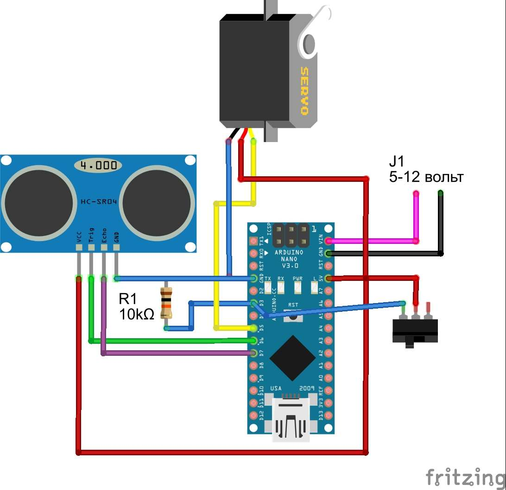

# Тема. Розумний будинок
## Розділ 1. Розробка вимог до системи та ПЗ.
#### Загальний опис проектованої системи.
Система для автоматичного відкривання "коробочки" за допомогою жесту руки

## Вимоги до функцій та задач.
Система повинна забезпечувати відображення в реальному часі, архівування та звітування відстані до об'єкту з можливістю онлайн контролю та керування. Контроль та керування повинно відбуватися через Arduino IDE. Відстань повинна фіксуватися в архівах з можливістю подальшого їх перегляду.
Система повинна передбачати виконання наступних функцій:
- неперервне вимірювання відстані до об'єкту (в сантиметрах) з періодичністю не більше ніж 1 секунда
- вимірювання руху за допомогою датчика
- безперешкодний рух механізму (серво-моторчика)
- індикація відстані через інтенсивність світіння світлодіоду
- архівування значень відстані до об'єкту в локальну базу даних середнє за останні 10 секунд
- відображення логу в систему

## Вимоги до видів забезпечення.
*Вимога до апаратного забезпечення*
Необхідно використання наступних засобів:
- Arduino
- Сервомоторчик
- Датчики наближення від 0 до 2 метрів
- Компьютер чи ноутбук
- Контейнер
- Прототип буде знаходитися у кімнатних умовах

*Вимога до програмного забезпечення*
- Arduino IDE
- Мова програмування С (Си)
- Система керування базами даних
- Фізичні датчики, що передбачається підключати до RPI
- Підключення до мережі Internet

## Розробка архітектури та необхідної проектної документації
Приклад відомості апаратних засобів

| Найменування                           | Кількість | Опис                                                         | Примітка                                                  |
| -------------------------------------- | --------- | ------------------------------------------------------------ | --------------------------------------------------------- |
| Arduino Uno                         | 1         | https://arduino.ua/prod32-arduino-uno-rev3-a000066                 | У комплекті з корпусом та блоком живлення |
| Макетна плата 170                      | 1         | https://arduino.ua/prod238-maketnaya-plata-mikro-bespaechnaya-syb-170-170-tochek |                                                           |
| Ультразвуковий датчик відстані HC-SR04 | 1         | https://arduino.ua/prod182-yltrazvykovoi-datchik-rasstoyaniya-hc-sr04 |                                                           |
| Сервопривiд                             | 1         |                                                              |                                                           |
| Резистор 10 кОм                         | 1         |                                                              |                                                           |
| Провід dupont (мама-тато)              | 11         |                                                              | 2 червоні, чорний, зелений, жовкий, 4 синiх, рожевий та фiолетовий                        |

Усі основні компоненти, зокрема Raspberry PI, кожен датчик, виконавчий механізм, монтажні плати та інша периферія та спосіб його використання необхідно описати у цьому розділі. Наприклад, нижче наведений опис ультразвукового датчика відстані HC-SR04.

> **Ультразвуковий датчик HC-SR04** - це стабільний та  точний ultrasonic sonar (сонар) датчик відстані який не має "сліпих  зон". Може вимірювати відстань від 0 см до 1500мм, точність досягає 3  мм.

> ​	**Характеристики**
>
> - Робоча напруга: 3.8 - 5.5В
> - Тип: HC-SR04
> - Струм: 8 мА
> - Частота: 40 кГц
> - Максимальна дистанція: 1500 мм
> - Мінімальна дистанція: 0 см
> - Роздільна здатність: 3 мм
> - Ширина імпульсів: 10 мкс
> - Кут: 15 градусів
> - Зовнішні габарити: 37x20x15 мм
>
> ​	Рекомендується додатково [кронштейн для кріплення](https://arduino.ua/prod1244-kronshtein-dlya-krepleniya-yltrazvykovogo-datchika).
>
> ​	**Принцип роботи**
>
> 1. На вихід trig (тригер) посилаємо високий рівень протягом як мінімум 10мкс
>
> 2. Модуль починає посилати ультразвукові імпульси з частотою 40 кГц і  приймає їх назад, якщо в зоні видимості є будь-які перешкоди
>
> 3. Якщо сигнал повертається, модуль встановлює низький рівень на виході echo на 150мс. За часом, який минув з п.1 до низького рівня на виході  echo можна розрахувати відстань до перешкоди за формулою:
>
>  **Відстань = (time \* sound velocity)/2**
>
>  де **time** - виміряний час імпульсу, **sound velocity** - швидкість звуку (340 м/с)

## Детальна схема проекту

